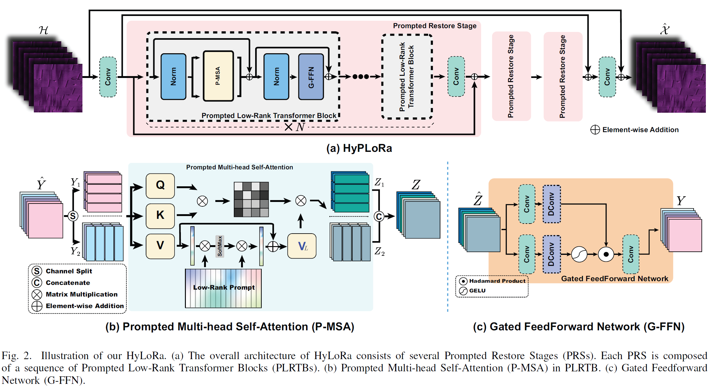
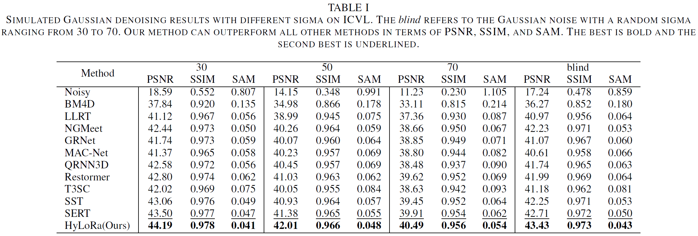
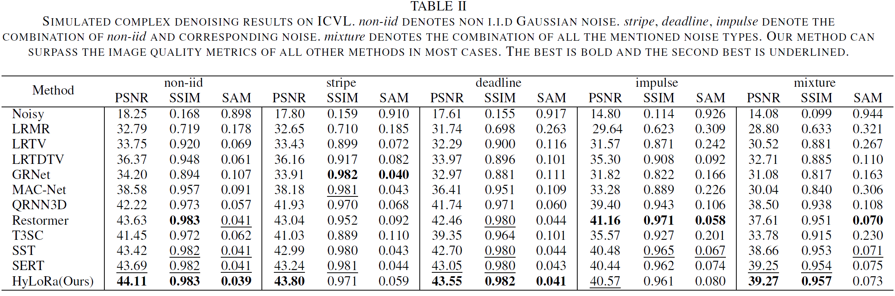

# HyLoRa
Low-Rank Prompt-Guided Transformer for Hyperspectral Image Denoising



## Guide
You can use training code from [HSDT](https://github.com/Zeqiang-Lai/HSDT)  or 
Install the [HSIR](https://github.com/bit-isp/HSIR) package, and clone this repository. 

Then run command as follows,
```
python -m hsirun.train -a model.hylora -s schedule.denoise_default
```

## Partial Experiments




## Citation

```bibtex
@article{tanxiaodong2024lowrankprompt,
  author={Tan, Xiaodong and Shao, Mingwen and Qiao, Yuanjian and Liu, Tiyao and Cao, Xiangyong},
  journal={IEEE Transactions on Geoscience and Remote Sensing}, 
  title={Low-Rank Prompt-Guided Transformer for Hyperspectral Image Denoising}, 
  year={2024},
  doi={10.1109/TGRS.2024.3414956}}
```
## Acknowledgements
This repository is based on [HSIR](https://github.com/bit-isp/HSIR).
